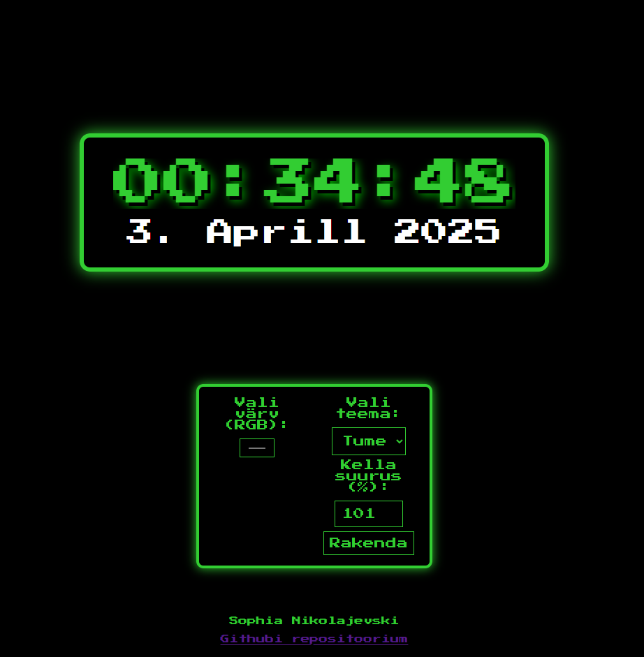

# 1-kodutoo

AUTOR: Sophia Nikolajevski
[GitHubi repositoorium](https://github.com/kasutajanimi/repositoorium)
Samuti võimalik näha siin: (https://www.tlu.ee/~cooly/kodutoo1/clock.html)

Funktsionaalsus: 
1. Kella kuvamine ja uuendamine
    Kella kuvatakse ja uuendatakse reaalajas, uuendades iga sekund.
    Kuud kuvatakse eesti keelsete nimedega.

2. Teema valik: Dark või Light theme
    Kellale võimalik valida kas must või valge variant.
    Tume teema - must taust, rohelised ja valged elemendid. (default)
    Hele teema - valge taust, rohelised ja mustad elemendid.
    Tausta üleminekud on sujuvad.

3. Kasutaja saab muuta kella suurust scrollwheeliga.
    Kella suurust on võimalik muuta hiire scrollimisega. (scale väärtus vahemikus 0.3 - 1.5).
    Valikute kast on fikseeritud.

4. "Up" ja "Down" arrow key peegepilt
    Vajutades üles või alla nooleklahvi, saab kella peegelpilti keerata.
    Peegelpildis kuvatakse numbrid tagurpidi, kuid samas kohas.

5. "F" key fullscreen mode
    Võimaldab näha kella fullscreenil ja peidab "valikute kasti", et oleks ainult kell näha.

6. Kuupäeva teksti peale saab "clickida"
    Vajutades kuupäeva peale hiireklõpsuga vahetub kuupäeva teksti font juhuslikult.

7. Tausta värvi saab RGB colorwheeliga valida.
    Kasutaja saab RGB värvivalijaga muuta tausta värvi.
     
8. Kella suumimine protsendi järgi
    Sisestades protsendi väärtuse vastavasse lahtrisse ja vajutades nuppu, muutub kella suurus.

9. Automaatne ümberkohandamine akna suuruse muutmisel
    Kui akna suurust muudetakse. säilib kella keskne positsioon ja skaala.

