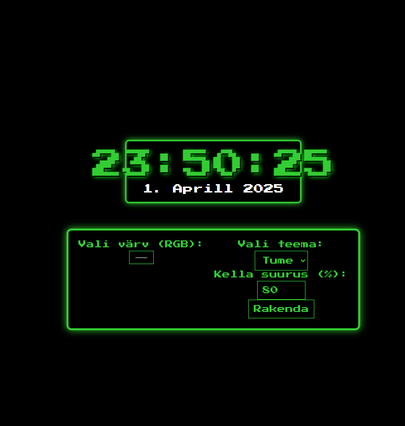

# 1-kodutoo

AUTOR: Sophia Nikolajevski

(Veel on vaja parandusi/täiendusi teha, väga vabandan, et üle tähtaja ja loodan, et siiski võtate arvesse ka hilisemaid parandusi.)

Funktsionaalsus: 
1. Teema valik: Dark või Light theme
2. Scroll wheeliga saab zoomida
3. "Up" ja "Down" arrow key muudavad numbrid peegelpilti
4. "F" key fullscreen mode
5. Kuupäeva teksti peale saab "clickida"
6. Tausta värvi saab RGB colorwheeliga vahetada.
7. Saab sisestada ka zoomi (%) arvu.

## Nõuded

1. Veebirakendus töötab. Näitab kella, kuupäeva, nädalapäeva ja aastat.
1. Vastavalt kasutaja tegevusele on võimalik muuta **kuut** lauakella atribuuti muuta.
1. Kasutatud on eventListener'e ja funktsioone.
1. Kell on originaalne ning kasutajaliides on maitsekalt kujundatud kasutades CSS-i. 
1. Autori ees- ja perenimi on lehel välja toodud
1. Lehel on viide rakenduse repositooriumile
1. `README.md` failis on välja toodud autori nimi, ekraanipilt rakendusest ja kirjeldatud funktsionaalsus

